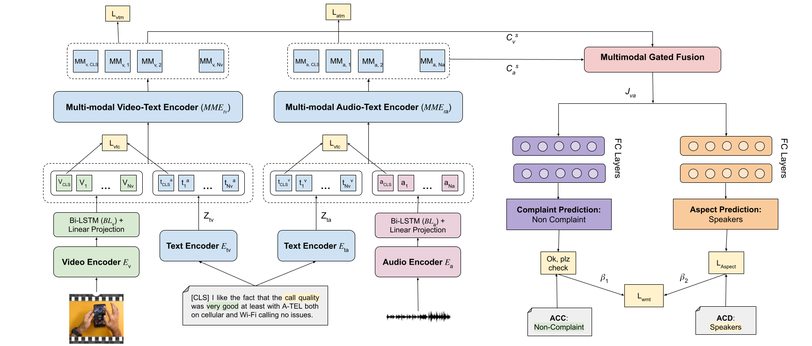

# MAACA: Multimodal Aspect-Aware Complaint Analysis for E-commerce Video-based Product Reviews
[Dataset](data/) | [Presentation](Presentation.pdf) | [Paper](https://openreview.net/pdf/1ef5082841dc737c3f0dfbc4617fc60c8c2d59a3.pdf)

This repo is the official implementation and dataset for the ACM Multimedia 2024 paper ["Seeing Beyond Words: Multimodal Aspect-Level Complaint
Detection in Ecommerce Videos"](https://openreview.net/pdf/1ef5082841dc737c3f0dfbc4617fc60c8c2d59a3.pdf).

## Introduction
- We introduce the Video Complaint Dataset (VCD), a novel resource aimed at advancing research in aspect-level complaint
detection.
- We propose a Multimodal Aspect-Aware Complaint Analysis
(MAACA) framework for aspect-level complaint detection
from discourse (ACDD). MAACA extends the [ALPRO](https://github.com/salesforce/ALPRO) pretraining strategy, to incorporate the audio modality into
its architecture as well as in its pre-training strategy. Furthermore, MAACA incorporates a moment retrieval step, augmenting the identification of pertinent segments within the
video clip crucial for the accurate detection of fine-grained
aspect categories and aspect-level complaints.
- We propose a gated-fusion mechanism to efficiently integrate
multimodal representations while considering the varying
importance of each feature through a gating mechanism.
- Extensive experiments conducted on the VCD dataset demonstrate the significant superiority of our framework over existing multimodal baselines, providing valuable insights into
the application of multimodal representation learning frameworks for downstream tasks.

## Model Architecture


  
## Dataset
The Video Complaint Dataset (VCD) is a novel resource aimed at advancing research in aspect-level complaint detection from video. 
The CSV files containing the train and test split used in the paper is made available under the `data` folder. The combined csv file represents the VCD dataset.
The audio and corresponding video for each video clip can be obtained by running the `download_video.py` script.
The corresponding moment retrieved timestamps are obtained from running CGDETR model on the video clips.

### Download Video and Audio Data
`download_video.py` downloads videos and extracts audio from a combined CSV file containing video links and timestamps.

Run the script with the following command:

```sh
python download_video.py --data_train="data/data_train.csv" \ 
                         --data_val="data/data_val.csv" \
                         --video_dir="data/video" \
                         --audio_dir="data/audio"
```
### Moment Retrieval
`predicted_time_intervals.csv` contains the predicted time intervals for each video clip obtained from the CGDETR model. 
To obtain the predicted time intervals yourself, clone the CGDETR repository and run [`run_on_video/run.py`](https://github.com/wjun0830/CGDETR/blob/main/run_on_video/run.py) with prompts being simply the name of the category of products in the dataset ("Phone", "Laptop", "Camera"). 
Then, the time frame corresponding to the highest saliency score across all the prompts is taken. 

## How to Run
### Install Requirements
Install the required Python libraries:
```sh
pip install -r requirements.txt
```

### Training
Ensure you have the necessary CSV files (`data_train.csv`, `data_val.csv`, and `predicted_time_intervals.csv`) in the data directory.

Run the training script with the following command:
```sh
python train.py --pretraining False \
                --video_dir data/video \
                --audio_dir data/audio \
                --train_csv_dir data/data_train.csv \
                --val_csv_dir data/data_val.csv \
                --intervals_path data/predicted_time_intervals.csv \
                --device cuda:0 \
                --run_name maaca \
                --output_dir output/maaca \
                --num_train_epochs 15 \
                
```

Important Arguments 
- `--pretraining`: Boolean flag to indicate if pretraining should be performed. If set to true, the code will perform pretraining with MAACAPretrain Model otherwise it will perform training with MAACA.
- `--video_dir`: Directory containing the video files. Default is `data/video`.
- `--audio_dir`: Directory containing the audio files. Default is `data/audio`.
- `--train_csv_dir`: Path to the training CSV file. Default is `data/data_train.csv`.
- `--val_csv_dir`: Path to the validation CSV file. Default is `data/data_val.csv`.
- `--intervals_path`: Path to the CSV file containing predicted time intervals. 
- `--device`: Device to run the training on (e.g., `cuda:0` for GPU or `cpu` for CPU). 
- `--run_name`: Name of the training run. 
- `--output_dir`: Directory to save the output of the training. 
- `--num_train_epochs`: Number of epochs to train the model. 

This will start the training process using the specified configurations and dataset. The model and metrics will be saved in the output directory.


[//]: # (## Citation)

[//]: # ()
[//]: # (If you find this repo useful, please cite our paper:)

[//]: # ()
[//]: # (```bibtex)

[//]: # (@inproceedings{maaca,)

[//]: # (  title={Seeing Beyond Words: Multimodal Aspect-Level Complaint Detection in Ecommerce Videos},)

[//]: # (  author={Anonymous},)

[//]: # (  booktitle={Anonymous},)

[//]: # (  year={2024})

[//]: # (})

[//]: # (```)